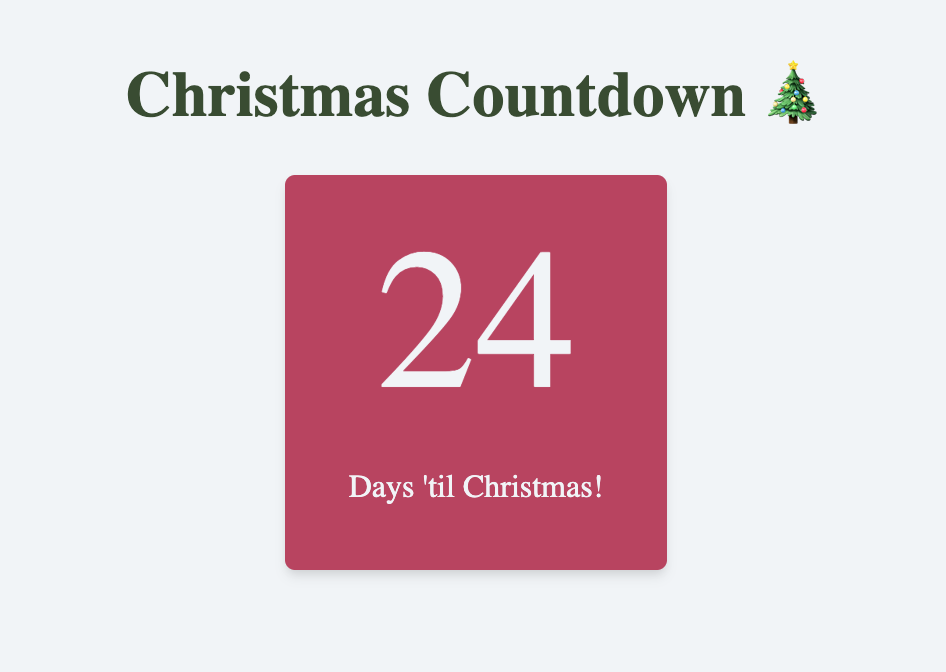
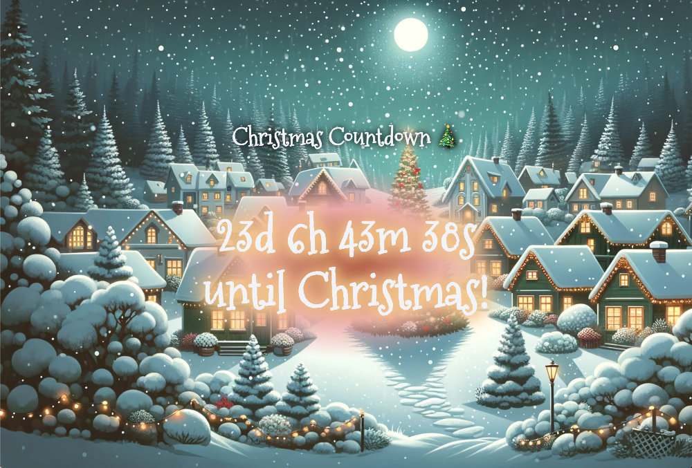

# JavaScriptmas Day 1: Countdown to Christmas

## Overview
This project features a simple JavaScript application that counts down the days until Christmas. It highlights fundamental JavaScript concepts such as DOM manipulation, date handling, and conditional logic.



## Table of Contents
1. [Project Overview](#overview)
2. [Features](#features)
3. [Code Explanation](#code-explanation)
4. [Stretch Goals](#stretch-goals)

## Features
- Displays the number of days remaining until Christmas.
- Updates dynamically every time the page is loaded.

## Code Explanation
The main functionality of the countdown is encapsulated within the `renderCountdown` function. Here's a step-by-step breakdown:


```javascript
const countdownDisplay = document.getElementById("countdown-display")

function renderCountdown(){
    const christmas = 25; // Sets the Christmas date.
    const today = new Date(); // Gets today's date.
    const todayDate = today.getDate(); // Extracts the day of the month.
    const remainingDays = christmas - todayDate; // Calculates the days left until Christmas.
    countdownDisplay.textContent = remainingDays; // Displays the remaining days.
}

renderCountdown();
```

## Code Elements Explained
- `document.getElementById("countdown-display")`: Selects the HTML element to display the countdown.
- `new Date()`: Retrieves the current date.
- `getDate()`: Extracts the day of the month from today's date.
- `textContent`: Used instead of `innerText` for performance and to avoid any potential security issues with HTML content.

## Stretch Goals

In addition to the main functionality, the project also includes several stretch goals that have been implemented to enhance the application:

- **Display Hours, Minutes, Seconds**: Beyond just showing the days remaining, the application now displays the exact time left including hours, minutes, and seconds, which updates every second for a real-time countdown.

- **Auto-Updating Countdown**: The countdown automatically updates the display every second, showing the precise time until Christmas without the need to refresh the page.

- **Styling for Festivity**: The application features festive styling with a radial gradient background that smoothly transitions into a charming Christmas village scene, providing a visually pleasing and thematic user experience.



Here's a snippet of the code that accomplishes these stretch goals:

```javascript

const countdownDisplay = document.getElementById('countdown-display')

function renderCountdown() {
    const now = new Date();
    const currentYear = now.getFullYear();
    const christmas = new Date(currentYear, 11, 25);
    if (now > christmas) {
        christmas.setFullYear(currentYear + 1);
    }

    const totalSeconds = Math.floor((christmas - now) / 1000);
    const days = Math.floor(totalSeconds / (3600 * 24));
    const hours = Math.floor(totalSeconds / 3600) % 24;
    const minutes = Math.floor(totalSeconds / 60) % 60;
    const seconds = totalSeconds % 60;

    countdownDisplay.textContent = `${days}d ${hours}h ${minutes}m ${seconds}s until Christmas!`;
}

// Update the countdown every second
setInterval(renderCountdown, 1000);
```

This function renderCountdown is called every second using setInterval, ensuring the countdown is always current down to the last second.


Quick start:

```
$ npm install
$ npm start
````

Head over to https://vitejs.dev/ to learn more about using vite
## About Scrimba

At Scrimba our goal is to create the best possible coding school at the cost of a gym membership! 💜
If we succeed with this, it will give anyone who wants to become a software developer a realistic shot at succeeding, regardless of where they live and the size of their wallets 🎉
The Frontend Developer Career Path aims to teach you everything you need to become a Junior Developer, or you could take a deep-dive with one of our advanced courses 🚀

- [Our courses](https://scrimba.com/allcourses)
- [The Frontend Career Path](https://scrimba.com/learn/frontend)
- [Become a Scrimba Pro member](https://scrimba.com/pricing)

Happy Coding!
